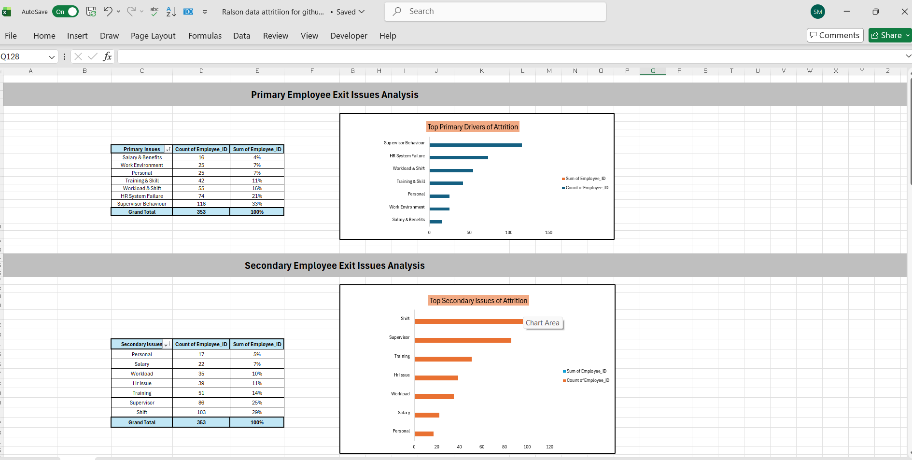

# Ralson.India.Limited-Attrition-Analysis-2026
353 exit interviews | Ralson India Plant 2026 | 78% exits preventable | Root cause analysis, Excel dashboard, HR recommendations.          #hr-analytics  #attrition-analysis  #exit-interview  #people-analytics  #excel-dashboard  #workforce-analytics  #hr-intern  #plant-hr
# 🏭 Plant Attrition Analysis — Ralson India Ltd. | 2026

<div align="center">


**353 real employee voices. One brutal truth: 78% of exits were preventable.**

*Conducted by Shiva Mishra — HR Intern | TISS Mumbai LSP | HR Analytics & People Technology*

</div>

---

## ⚡ Project at a Glance

## 📸 Dashboard Preview


(dashboard.2.png)

> *"95 employees walked out the door — not because of salary, not because of personal reasons — but because HR ignored their complaint. That's not attrition. That's a system failure."*

This is not a textbook case study. This is a **live, independent field research project** conducted inside a tyre manufacturing plant — with real workers, real pain points, and real consequences. Every number in this repository represents a human being who left a job and was willing to tell us exactly why.

| Parameter | Details |
|-----------|---------|
| **Company** | Ralson India Limited — Tyre Manufacturing Plant |
| **Project Type** | Exit Interview Analysis + Root Cause Dashboard |
| **My Role** | Sole analyst — designed the framework, conducted interviews, built the dashboard |
| **Data Source** | 353 telephone exit interviews (April 2026) |
| **Department Coverage** | Production + Production Cycle |
| **Output** | Structured dataset + Excel Dashboard + Recommendations to Management |

---

## 🔴 The Critical Numbers (What Management Needed to See)

<table>
<tr>
<td width="50%">

### 🚨 Final Exit Triggers
| Trigger | Count | % of Total |
|---------|-------|-----------|
| **HR Ignored Complaint** | **95** | **26.9%** |
| Shift Problem | 69 | 19.5% |
| Physical Violence | 62 | 17.6% |
| Supervisor Abuse | 55 | 15.6% |
| Salary Issue | 28 | 7.9% |

</td>
<td width="50%">

### 📊 Primary Issue Categories
| Issue | Count | % of Total |
|-------|-------|-----------|
| **Supervisor Behaviour** | **116** | **32.9%** |
| HR System Failure | 74 | 21.0% |
| Workload & Shift | 55 | 15.6% |
| Training & Skill | 53 | 15.0% |
| Work Environment | 26 | 7.4% |

</td>
</tr>
</table>

---

## 📉 Retention Reality Check

```
Would these employees have stayed if the issue was addressed?

  YES — Preventable Exits    ████████████████████████████████ 36%  (126 employees)
  MAYBE — Possibly Retained  ████████████████████████████████████████ 42%  (148 employees)
  NO — Unavoidable           ████████████████ 22%  (79 employees)

  ⚠️  78% of exits were preventable or potentially preventable.
```

**The business case for HR intervention writes itself.**

---

## 🕐 When Are People Leaving?

```
Tenure at Exit — Attrition Timing Distribution

  0–3 Months   ██████████████████████████████████████████████████ 57.5%  (203 exits)
  3–6 Months   ████████████████████████████████████████ 42.5%  (150 exits)

  INSIGHT: Over half the workforce leaves before completing 3 months.
  This is not attrition. This is an onboarding collapse.
```

---

## 📋 Satisfaction Ratings — What Employees Rated Before Leaving

| Parameter | Average (out of 5) | Signal |
|-----------|-------------------|--------|
| 🔴 **Supervisor Behaviour** | **2.41 / 5** | CRITICAL — Worst rated factor |
| 🔴 **Training Satisfaction** | **2.45 / 5** | CRITICAL — Workers feel unprepared |
| 🟡 **Workload & Shift** | **3.54 / 5** | MODERATE — Manageable with intervention |
| 🟡 **Salary Satisfaction** | **3.62 / 5** | MODERATE — Not the primary driver |

> **Key Insight:** Salary is NOT the top reason people are leaving. Supervisor behaviour and training gaps are — yet these are the most correctable HR problems.

---

## 🔍 Root Cause Analysis

```
Top Root Causes Identified Across 353 Cases:

  HR System Failure        ████████████████████████████████████████████ 87 cases
  Supervisor Abuse         ████████████████████████████████ 68 cases
  Shift Issues             ████████████████████████ 50 cases
  Workload Pressure        ████████████████████ 41 cases
  Training Gap             ████████████████ 34 cases
  Salary Issues            ██████████ 23 cases
  Unsafe Environment       ████████ 18 cases
  Personal Reasons         ██████ 13 cases
  Better Opportunity       ████ 7 cases
```

---

## 💡 Top Employee-Suggested Improvements (Ranked by Frequency)

These recommendations come **directly from workers** — not from management theory.

| Rank | Recommendation | Employees Who Suggested It |
|------|---------------|--------------------------|
| 🥇 | **Strict Action on Abuse** | 42 |
| 🥈 | **Better Complaint System** | 34 |
| 🥉 | **HR Support & Response** | 26 |
| 4 | Clear Rules & Discipline | 26 |
| 5 | Control Drugs & Alcohol | 25 |
| 6 | Stop Unfair Salary Deductions | 23 |
| 7 | Proper Shift Management | 23 |
| 8 | Stop Violence & Threats | 20 |
| 9 | Respectful Supervisor Behaviour | 20 |
| 10 | Reduce Workload Pressure | 18 |

---

## 🛠️ Methodology

### Phase 1 — Framework Design
- Designed a structured exit interview call script from scratch
- Created a coding framework to translate qualitative responses into categorical data
- Defined 8 primary issue categories, 10+ root cause labels, and 5 final trigger types

### Phase 2 — Data Collection
- Conducted and supervised **353 telephone exit interviews**
- Collected data across April 2026 — Production and Production Cycle departments
- Captured primary issue, secondary issue, root cause, final trigger per employee
- Recorded 4 satisfaction ratings per interview (Supervisor / Workload / Salary / Training)
- Documented employee improvement suggestions verbatim

### Phase 3 — Data Processing & Analysis
- Coded all raw qualitative responses into structured Excel datasets
- Built `Call_Data` and `Call_Data_Final` structured tables
- Created pivot tables across 10+ dimensions
- Segmented analysis by tenure bucket, department, section, exit type

### Phase 4 — Dashboard & Insights
- Built an Excel analysis dashboard with visual summaries
- Identified statistically significant patterns across root causes, triggers, and satisfaction
- Translated data into a clear narrative for HR management

### Phase 5 — Presentation & Recommendations
- Presented findings to HR leadership with data-backed recommendations
- Delivered a prioritised action plan mapped to employee-suggested improvements

---

## 📁 Repository Contents

```
📂 Ralson-Plant-Attrition-Analysis-2026/
│
├── 📊 Ralson_Plant_Attrition_Dashboard_2026.xlsx   ← Full Excel dashboard
│   ├── Sheet: Call_Data          (Raw interview data — 353 rows)
│   ├── Sheet: Call_Data_Final    (Cleaned & coded dataset)
│   ├── Sheet: Dashboard          (Visual analysis dashboard)
│   └── Sheet: Solution           (Improvement recommendations pivot)
│
├── 📋 Ralson_Plant_Attrition_HR_Interview_Kit.docx  ← Interview prep kit
│   └── 25+ cross-questions with model answers
│
└── 📄 README.md                                     ← You are here
```

---

## 🎯 Key HR Takeaways

### What This Data Proves:

**1. HR credibility is the #1 retention lever.**
When 95 employees cite "HR Ignored Complaint" as their final exit trigger, the data says HR's responsiveness — not salary packages — determines whether workers stay.

**2. The first 90 days are the retention window.**
57.5% of exits happen within 3 months. The onboarding and induction system is failing to build loyalty or address early warning signs before workers reach the point of no return.

**3. Supervisor behaviour is a business risk, not just an HR issue.**
116 employees (33%) cited supervisor behaviour as their primary issue. 68 root causes were supervisor abuse. Physical violence was reported by 62 workers. This is a compliance, legal, and operational risk — not just a people problem.

**4. The fix is not expensive — it's structural.**
The top employee-demanded interventions (strict action on abuse, a working complaint system, HR responsiveness) are system and culture changes. They require commitment, not budget.

---

## 📌 Skills Demonstrated

`HR Analytics` `Exit Interview Framework Design` `Qualitative Data Coding` `Quantitative Analysis`
`Excel Dashboard Building` `Pivot Table Analysis` `Root Cause Analysis` `People Data`
`HR Reporting` `Retention Analysis` `Workforce Insights` `Stakeholder Communication`

---

## 👤 About the Analyst

**Shiva Mishra**
HR Intern | TISS Mumbai — Master's in Labour Studies (LSP)
Specialisation: HR Analytics & People Technology

This project was independently designed and executed during my internship at Ralson India Limited. I owned the full pipeline — from interview script design to final recommendations — and presented findings directly to HR management.

📫 [(https://www.linkedin.com/in/shiva-mishraa)](#) · 📁 [More Projects](https://github.com/ShivaMishra-HRAnalytics)

---

<div align="center">

*Built from 353 real conversations. Driven by the belief that people don't quit jobs — they quit systems.*

</div>
